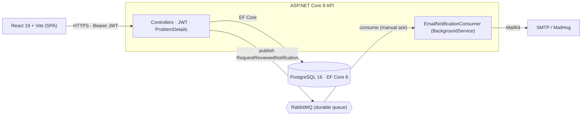

# TimeOff Manager

> A full-stack time-off / vacation manager — audited from a flawed legacy app and rebuilt on .NET 8 with Clean Architecture, automated tests, and CI.

[](https://github.com/lukascortes/nwoork-second-technical-test/actions/workflows/ci.yml)


---

## The story

This project began as a technical test: a React time-off app sitting on a flawed backend. Instead of patching it, I ran a **full technical audit** and used the findings as the spec for a ground-up rebuild.

The audit surfaced **critical security vulnerabilities** — among them an admin user-management controller with *no authorization at all*, a JWT signing key committed to source with a weak hardcoded fallback, client-supplied roles at registration, and over-posting on request creation. The full write-ups live in this repo:

- [`AUDIT_REPORT.md`](AUDIT_REPORT.md) — the original audit and findings
- [`SECURITY_REVIEW.md`](SECURITY_REVIEW.md) — security analysis (OWASP-mapped)
- [`ARCHITECTURE_ANALYSIS.md`](ARCHITECTURE_ANALYSIS.md) — architectural review
- [`TECH_DEBT_REPORT.md`](TECH_DEBT_REPORT.md) — technical-debt inventory
- [`IMPROVEMENT_ROADMAP.md`](IMPROVEMENT_ROADMAP.md) — the remediation plan

The backend was then **rebuilt on .NET 8 with Clean Architecture** (Domain / Application / Infrastructure / Api): a rich domain model with invariants and a state machine, FluentValidation, RFC 7807 ProblemDetails, BCrypt hashing, rate-limited auth, async email notifications over RabbitMQ, **50 automated tests**, and a **GitHub Actions CI pipeline** that builds and tests both backend and frontend on every push and PR. The [Security highlights](#security-highlights) table maps each audit finding to the fix that closed it.

---

## Architecture



When a request is approved/rejected the API publishes a notification and responds immediately; a `BackgroundService` consumer drains the queue and sends the email via MailKit. Publishing is **best-effort**, so a messaging outage never fails the review itself. The messaging and email ports are abstractions — swapping RabbitMQ for Azure Service Bus is an adapter change, not a rewrite.

---

## Tech stack

**Backend**
- .NET 8 (`net8.0`); SDK pinned via `global.json` (`8.0.100`, `rollForward: latestFeature`)
- Clean Architecture: `Domain` → `Application` → `Infrastructure` → `Api` (inward dependency rule)
- ASP.NET Core Web API, JWT bearer auth (HS256), built-in rate limiting
- EF Core 8 + Npgsql (PostgreSQL); migrations applied + demo data seeded on startup
- FluentValidation, RFC 7807 ProblemDetails global exception handler
- `BCrypt.Net-Next` (work factor 12) for password hashing
- `RabbitMQ.Client` publisher + `BackgroundService` consumer; `MailKit` SMTP sender

**Frontend**
- React 19 + Vite 7 + TypeScript 5.8
- Tailwind CSS 3.4, Heroicons + react-icons
- axios (Bearer-token request interceptor; 401 → logout/redirect)
- react-router-dom 7 with role-gated `ProtectedRoute`
- Formik + Yup (request form), date-fns (team-calendar math)

**Infra / tooling**
- Docker Compose: PostgreSQL 16, RabbitMQ 3 (management), MailHog, API
- Multi-stage Dockerfiles; the API image runs **non-root** (`USER app`)
- GitHub Actions CI (`.github/workflows/ci.yml`): backend build + test, frontend typecheck + build

---

## Features

**Auth & security**
- JWT login and self-registration (registration always assigns the `Employee` role **server-side**)
- Role-based authorization (`Admin` / `Employee`) enforced at the controller level
- Rate-limited auth endpoints (fixed window, 10 req/min per IP)
- BCrypt hashing; login user-enumeration timing is mitigated with a constant dummy hash

**Employee**
- Vacation-balance card (available / used / pending / annual allowance)
- Submit time-off requests (Vacation / Sick / Other) with client- and server-side validation
- Own request history with color-coded statuses

**Admin — requests**
- View every request (newest first); approve/reject pending ones (optimistic UI with rollback)
- Full user-management CRUD (can't delete your own account)

**Admin — metrics**
- Aggregate counts by status and type, as summary cards + CSS bar charts

**Admin — team calendar**
- Month grid (date-fns) of approved absences as per-day, type-colored chips, with month navigation and a legend

**Vacation balance — business rule**
- A `VacationBalance` value object computes remaining / projected-remaining days. On approval the service sums the employee's other approved **Vacation** days and **blocks the approval with HTTP 409** if it would exceed their `AnnualVacationDays`. Overlapping requests of the same type are rejected at create time.

**Async email notifications**
- Reviewing a request publishes a `RequestReviewedNotification` to RabbitMQ; the background consumer sends the email via MailKit/SMTP (MailHog in dev).

---

## Quickstart

**Prerequisites:** Docker (with Compose) and Node.js.

```bash
# 1. Build and start the stack (PostgreSQL, RabbitMQ, MailHog, API)
docker compose up --build -d

# 2. Start the frontend dev server (Vite — not a Compose service)
cd frontend && npm install && npm run dev
```

The database is migrated and seeded automatically on first run.

### URLs

| What | URL |
| --- | --- |
| Frontend (Vite dev) | http://localhost:5173 |
| API | http://localhost:5000 |
| Swagger UI | http://localhost:5000/swagger |
| API health | http://localhost:5000/health |
| MailHog inbox | http://localhost:8025 |
| RabbitMQ management UI | http://localhost:15672 (`guest` / `guest`) |

### Seeded demo credentials

| Name | Email | Password | Role | Annual vacation days |
| --- | --- | --- | --- | --- |
| Alex Admin | `admin@timeoff.dev` | `Admin123!` | Admin | 30 |
| Emma Stone | `emma@timeoff.dev` | `Employee123!` | Employee | 20 |
| Liam Carter | `liam@timeoff.dev` | `Employee123!` | Employee | 20 |

**Try the full async flow:** log in as **Emma** → submit a request → log in as **Alex** → approve it → the approval email appears in the [MailHog inbox](http://localhost:8025). Approving a vacation that exceeds the allowance is blocked with a clear 409.

---

## API

| Method | Route | Auth | Purpose |
| --- | --- | --- | --- |
| POST | `/api/auth/register` | Anonymous | Self-register (always `Employee`) |
| POST | `/api/auth/login` | Anonymous | Obtain a JWT |
| GET | `/api/users` | Admin | List users |
| GET | `/api/users/{id}` | Admin | Get a user |
| GET | `/api/users/{id}/vacation-balance` | Admin | A user's vacation balance |
| POST | `/api/users` | Admin | Create a user |
| PUT | `/api/users/{id}` | Admin | Update a user |
| DELETE | `/api/users/{id}` | Admin | Delete a user (not yourself) |
| POST | `/api/timeoffrequests` | Employee | Submit a request |
| GET | `/api/timeoffrequests/me` | Employee | List my requests |
| GET | `/api/timeoffrequests/balance` | Employee | My vacation balance |
| GET | `/api/timeoffrequests` | Admin | List all requests |
| GET | `/api/timeoffrequests/stats` | Admin | Aggregate metrics |
| PUT | `/api/timeoffrequests/{id}/status` | Admin | Approve / reject |
| GET | `/health` | Anonymous | Health check |

---

## Security highlights

Each row maps an original audit finding to the fix that closed it.

| Finding | Fix |
| --- | --- |
| **S1** — User CRUD with no authorization | `[Authorize(Roles = "Admin")]` on the whole users controller |
| **S2** — JWT secret committed + weak fallback | Key read from config, **validated (≥ 256-bit) at startup**, no fallback; issuer/audience/lifetime validated; **UTC** expiry |
| **S3** — Client-supplied role at registration | Registration forces `Employee` server-side |
| **S9** — Over-posting on request creation | Input DTO carries no `userId`/`status`; the server is the sole authority |
| **TD-06** — Duplicate emails | Unique index + email normalization |
| **TD-10** — Cascade delete wiped history | Foreign key set to `Restrict` |
| **TD-13** — Numeric enums on the wire | Enums serialized as strings |
| **B2** — JWT expiry in local time | Expiry computed in UTC |

---

## Testing

**50 tests** across three projects (run by CI on every push/PR):

| Project | Tests | Scope |
| --- | --- | --- |
| `TimeOffManager.Domain.UnitTests` | 18 | Entity invariants, the request state machine, vacation-balance math |
| `TimeOffManager.Application.UnitTests` | 22 | Use cases with mocked ports (auth, users, requests, the allowance rule) |
| `TimeOffManager.Api.IntegrationTests` | 10 | Full HTTP stack via `WebApplicationFactory` over in-memory SQLite (no Docker needed) |

```bash
dotnet test backend/TimeOffManager.sln
```

---

## Project structure

```
backend/
  src/
    TimeOffManager.Domain/          # entities, value objects, enums (no dependencies)
    TimeOffManager.Application/     # use cases, DTOs, validators, ports (interfaces)
    TimeOffManager.Infrastructure/  # EF Core, JWT, BCrypt, RabbitMQ, MailKit
    TimeOffManager.Api/             # controllers, auth, ProblemDetails, Swagger
  tests/                            # Domain / Application / Api integration tests
frontend/
  src/                             # React 19 + TypeScript app (pages, hooks, api, components)
docs/screenshots/                  # product screenshots for this README
docker-compose.yml                 # api + postgres + rabbitmq + mailhog
.github/workflows/ci.yml           # build + test (backend & frontend)
AUDIT_REPORT.md … IMPROVEMENT_ROADMAP.md   # the audit deliverables
```

---

## Screenshots

> Product screenshots/GIFs live in [`docs/screenshots/`](docs/screenshots/) — add yours and embed them here. Good candidates: the employee vacation-balance card, the admin metrics and team-calendar tabs, and a MailHog approval email.

---

## Roadmap

- **Hito 4 — Azure deploy:** API on Azure Container Apps, managed PostgreSQL, **Azure Service Bus** in place of RabbitMQ, and a hosted SMTP/email provider in place of MailHog — each is an adapter swap behind the existing `IMessagePublisher` / `IEmailSender` ports, with a cloud budget alert to keep costs near zero.
- Refresh tokens + server-side logout; pagination/filtering on list endpoints; richer audit history.
